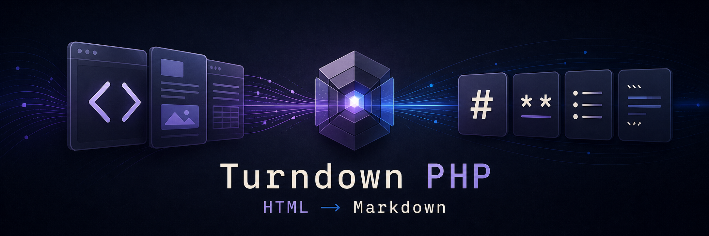

# Turndown PHP



**English** | [简体中文](README.zh-CN.md) | [繁體中文](README.zh-TW.md)

> 🌐 **[Visit the Turndown PHP project website →](https://turndown-php.catou.se/)**

Turndown PHP is a configurable HTML-to-Markdown converter for PHP 8.1+. It is an independent PHP port compatible with [Turndown 7.2.4](https://github.com/mixmark-io/turndown/tree/fb7a865ef5eba4081dfd4e20a894a61ef7a2edca) and includes PHP ports of the [official GFM plugins](https://github.com/mixmark-io/turndown-plugin-gfm/tree/61a981b8c6aaec73bbb8a844d9f8686d0d5f066e).

## Installation

The package requires PHP 8.1 or later with the DOM and Mbstring extensions:

```bash
composer require catouse/turndown-php
```

## Usage

```php
<?php

use Catouse\Turndown\TurndownService;

$service = new TurndownService([
    'headingStyle' => 'atx',
]);

$markdown = $service->turndown('<h1>Hello world!</h1>');

// # Hello world!
```

`turndown()` accepts either an HTML string or one of the supported DOM node types: `DOMDocument`, `DOMDocumentFragment`, or `DOMElement`:

```php
$document = new DOMDocument();
$document->loadHTML('<div><p>Hello <strong>world</strong>.</p></div>');

$markdown = $service->turndown($document);
```

## Options

Options are passed to the constructor. The defaults match Turndown 7.2.4:

| Option | Accepted values | Default |
| --- | --- | --- |
| `headingStyle` | `setext`, `atx` | `setext` |
| `hr` | Markdown thematic break | `* * *` |
| `bulletListMarker` | `-`, `+`, `*` | `*` |
| `codeBlockStyle` | `indented`, `fenced` | `indented` |
| `fence` | `` ``` `` or `~~~` | `` ``` `` |
| `emDelimiter` | `_`, `*` | `_` |
| `strongDelimiter` | `**`, `__` | `**` |
| `linkStyle` | `inlined`, `referenced` | `inlined` |
| `linkReferenceStyle` | `full`, `collapsed`, `shortcut` | `full` |
| `preformattedCode` | `bool` | `false` |
| `br` | Markdown inserted before the newline for `<br>` | two spaces |

The advanced options `blankReplacement`, `keepReplacement`, and `defaultReplacement` accept a callable with this shape:

```php
function (string $content, DOMElement $node, array $options): string
```

Options are merged loosely: unknown keys are retained and made available to custom filters and replacements. Invalid values are not normalized, so callers should use the documented values for built-in options.

## Rules

Add a custom rule with a lowercase tag name, a list of tag names, or a callable filter:

```php
$service->addRule('strikethrough', [
    'filter' => ['del', 's', 'strike'],
    'replacement' => static function (
        string $content,
        \DOMElement $node,
        array $options,
    ): string {
        return '~'.$content.'~';
    },
]);
```

A rule has the following shape:

```php
array{
    filter: string|list<string>|callable,
    replacement: callable,
    append?: callable
}
```

Callable filters receive `DOMElement $node` and the merged options array. Replacement callables receive `string $content`, `DOMElement $node`, and the merged options. An optional `append` callable receives the merged options and appends content after conversion.

Rule precedence follows Turndown: blank elements, added rules, built-in CommonMark rules, kept elements, removed elements, then the default rule.

```php
$service
    ->keep(['del', 'ins'])
    ->remove('script');
```

`keep()` preserves matching elements as serialized HTML. `remove()` removes a matching element together with its contents. Both accept the same string, list, or callable filters as a rule.

## GFM plugins

`Gfm` installs highlighted fenced code blocks, strikethrough, tables, and task-list items together:

```php
use Catouse\Turndown\Plugin\Gfm;

$service->use(new Gfm());
```

Each plugin can also be installed independently or as an iterable:

```php
use Catouse\Turndown\Plugin\Strikethrough;
use Catouse\Turndown\Plugin\Tables;

$service->use([
    new Tables(),
    new Strikethrough(),
]);
```

Available invokable plugin classes are `Gfm`, `HighlightedCodeBlock`, `Strikethrough`, `Tables`, and `TaskListItems` in the `Catouse\Turndown\Plugin` namespace.

## Public API

The main class is `Catouse\Turndown\TurndownService`. It is intentionally not final, so applications can subclass it to customize behavior such as escaping.

```php
__construct(array $options = [])
turndown(string|DOMNode $input): string
addRule(string $key, array $rule): static
keep(string|array|callable $filter): static
remove(string|array|callable $filter): static
use(callable|iterable $plugin): static
escape(string $text): string
```

Configuration methods return the service instance for chaining. A plugin is an invokable callable that receives the service, or an iterable of such callables.

## Parsing and security

String input is parsed with [Masterminds HTML5-PHP](https://github.com/Masterminds/html5-php), while JavaScript Turndown operates on a browser DOM or Domino. Malformed markup recovery, namespaces, entity decoding, generated wrapper elements, whitespace, and serialized HTML retained by `keep()` can therefore differ. In particular, Masterminds documents limited support for some [insertion modes and the adoption-agency algorithm](https://github.com/Masterminds/html5-php#known-issues-or-things-we-designed-against-the-spec). Supplying a supported DOM node uses the tree produced by the caller's parser. The project targets equivalent behavior for valid HTML and verifies it against the pinned official fixtures, but does not promise byte-for-byte parser parity for malformed HTML.

This library is a converter, not a sanitizer. It does not validate URL schemes or guarantee that input HTML, retained raw HTML, or generated Markdown is safe to render. Sanitize untrusted input according to your application's threat model, and treat the generated Markdown as untrusted when rendering it back to HTML.

## Development

Install development dependencies and run the complete validation suite:

```bash
composer install
composer check
```

`composer check` validates `composer.json`, checks code style, runs PHPStan at its maximum level, and executes the PHPUnit suite. CI runs the suite on PHP 8.1 through 8.5 with both lowest and latest dependency sets. This library intentionally does not commit `composer.lock`.

## License and attribution

Turndown PHP is released under the [MIT License](LICENSE). See [THIRD_PARTY_NOTICES.md](THIRD_PARTY_NOTICES.md) for upstream and dependency attributions.
